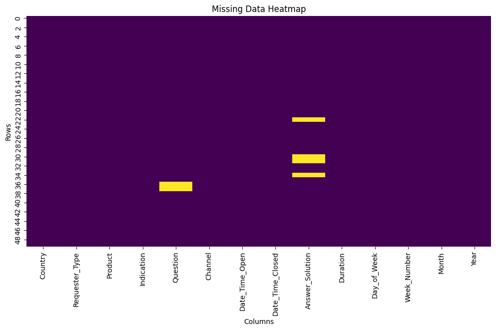
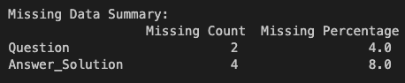
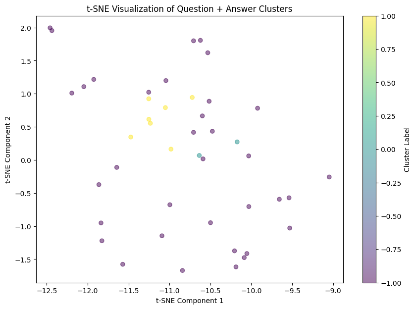
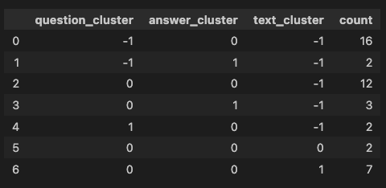
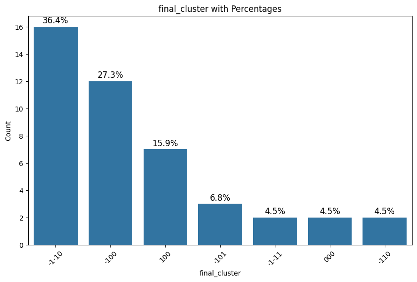
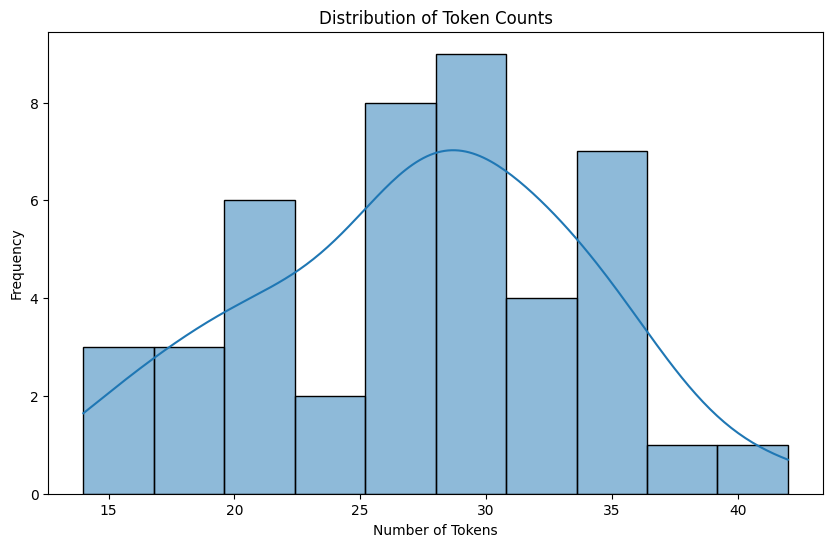

# RAG Proposal

Given the questions and answers, I propose that this information should be presented as a cohesive text. Specifically, the index should include both the question and answer as a single semantic unit.

## Missing Data Analysis

The missing value pattern is illustrated in the following image:

The percentage of missing values is shown in this image:

I will delete the missing values, as I consider that the percentage (12%) is not significant.

## Clustering and Embedding

I have three sources of text:

1. **Text:** Question + Answer
2. **Questions**
3. **Answers**

For each source, I performed embedding generation and clustering analysis. This cluster analysis allows me to extract potential labels to understand any relationships with categorical variables. The next image shows the T-SNE plot of the clusters for the text, where there are three clusters:

From the combination of questions, answers, and text, there can be up to seven potential clusters, as illustrated in the following graph:

### Cluster Insights

#### First Cluster
The first cluster appears to be more related to the effects of the drug:

1. **What are the common side effects of Keytruda?** Common side effects include fatigue, nausea, and skin rash.
2. **Can Keytruda cause changes in blood pressure?** Yes, fluctuations in blood pressure can occur, and patients should monitor their blood pressure regularly.

#### Second Cluster
The second cluster is also related to effects but is more specific to the term NSCLC:

1. **How do the results of KEYNOTE-006 influence future research directions for NSCLC treatment?** The results encourage further research into immunotherapy combinations, personalized medicine based on genetic markers, and strategies to overcome resistance to PD-1 inhibitors.
2. **Can Keytruda be used in NSCLC patients with autoimmune diseases?** Keytruda should be used with caution in patients with pre-existing autoimmune diseases due to the risk of exacerbating their condition.

The final cluster percentages are shown in the following image:

The word clouds for the clusters of questions and answers can be found in the following file [Cluster word clouds](EDA.ipynb)

## Analysis with Categorical Variables

After conducting an independence test between the clusters and categorical variables, it was determined that they are independent. This finding makes sense since the semantic meaning of the text does not relate to factors such as data or distribution channels.

## Getting the Distribution of Tokens in the Text

The distribution of tokens is illustrated in the following image:

The maximum number of tokens is around 50, indicating that this is relatively short text. As a result, no chunking will be needed later when indexing the data.

## Getting the Evaluation Set

Later, I will evaluate the RAG system using a set of evaluation questions. The evaluation will be performed using the RAGAS framework. For each question in the dataset, an augmentation process generates five new questions.

The code for this process can be found in the notebook:

[Evaluation Set Generation Using Few-Shot Prompt](../RAG/4_evaluation_set.ipynb)

I utilized a few-shot prompt strategy to create the evaluation set.