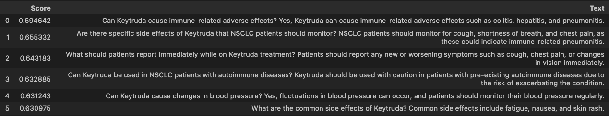
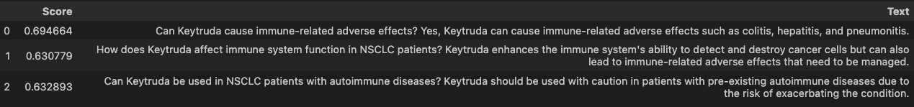
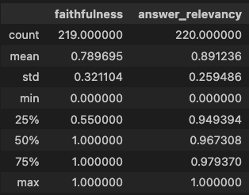
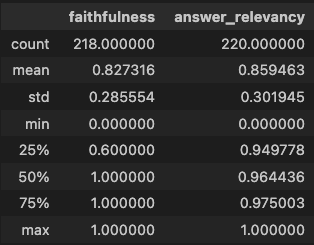

# Setting Up the Retrieval System

I have implemented a modular retrieval system consisting of the following components:

1. **Search Module**
2. **Reranking Module**

## Indexing

For the indexing process, I utilized **LlamaIndex**. You can find the indexing notebook [here](1_rag_indexing.ipynb). The indexed data is persisted in the `persist` folder.

## Retrieval

The notebook for configuring and experimenting with the retrieval module can be found [here](2_rag_retrieving_with_reranker.ipynb). In this module, I employed a top-k similarity search followed by the **RankGPTRerank** module for reranking.

### Query Example

When querying the retrieval system with the question: **"What are potential CONSEQUENCES of Keytruda?"**, I obtained the following results:

1. **Without Reranking**: The nodes retrieved are displayed below:

   

2. **With Reranking**: The nodes retrieved based on their index positions [0, 6, 3, 7, 1] from the original list are shown below:

   

### Observations

There is a noticeable difference in the nodes retrieved between the two methods. The reranked results appear to focus more on the immune effects associated with Keytruda, indicating that the reranking process effectively enhances the relevance of the retrieved information.

---

# Integrating the Generation Component and Evaluation with Ragas

I have implemented the generation component using OpenAI's **gpt-3.5-turbo** model.

The evaluation set is generated from [this notebook](4_evaluation_set.ipynb) using a few-shot prompting approach.

### Response Modes

When integrating the generation module, I used `response_mode="compact"`, which states:

1. **Refine**: Create and refine an answer by sequentially processing each retrieved text chunk, resulting in a separate LLM call per node/retrieved chunk.
2. **Compact**: Similar to refine but concatenates (compacts) the chunks beforehand, resulting in fewer LLM calls.

### Evaluation Metrics

The evaluation metrics from RAGAS include:

1. **Faithfulness**
2. **Answer Relevancy**

> **Note**: I only use these metrics since they do not require ground truth data for nodes—only the query, answer, and context (retrieved nodes).

### Evaluation Results

The results for the RAG system are as follows:

1. **With Reranking Module**:
   

2. **Without Reranking Module**:
   

### Potential Additional Experiments

Future experiments could explore different response modes beyond "compact." For instance:

1. **Refine**: Create and refine an answer by sequentially processing each retrieved text chunk, leading to multiple LLM calls—one per node/retrieved chunk.
2. **Tree Summarize**: Query the LLM using a summary template prompt as many times as necessary until all concatenated chunks have been queried. This results in multiple answers that are recursively used as chunks in a tree summarization LLM call until only one final answer remains.

